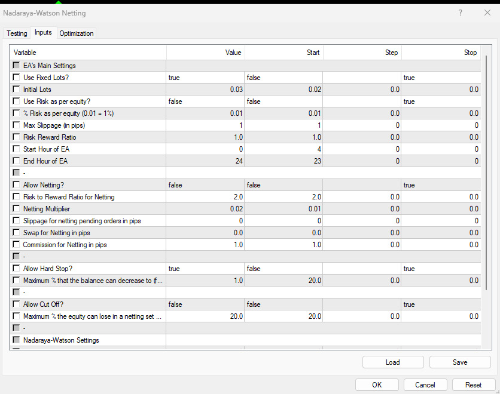

## Note: This application works on MT4 only

## Below are the steps that this application should take:
1. Open the Strategy Tester
2. Read the "Strategy Tester Settings" Excel sheet for the settings to choose in the Strategy Tester. The setting names are as per the column headers and their input values are given in the rows. The setting names after the "Expert properties" column header are the setting names in the Inputs popup: 
3. As per the settings, select the inputs on the Strategy Tester.
4. Click the Start button to run the Strategy Tester
5. Go to the report tab, right click and choose save as HTML
6. Save the generated report in the folder

## For programmers
1. In the `choose_EA()` function, there are 2 lines like this: `while i in range(50):`. Make sure that range is equal to/more than the number of EAs in the Experts folder on MT4.