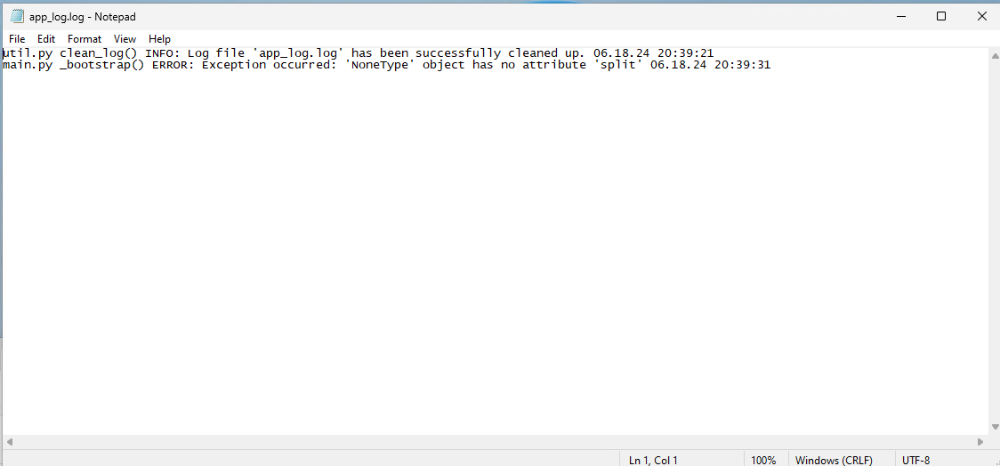

# Note on branch
This branch was created to save the changes I made for running this application on Windows Sandbox. 

## Explanation of files
1. There is a wsb file which you can double-click on to open the sandbox. It configures the sandbox by linking the folders on the main desktop to folders on the sandbox. This was done so that new files won't have to be created on the sandbox because they can simply be derived from the main desktop.
    - The 1st folder that is shared with the sandbox is `C:\Users\Puja\Work\Coding\Python\For Poolsifi\Backtest Automater`. It is linked  with `C:\Users\WDAGUtilityAccount\Desktop` in the sandbox. This was done so that the Backtest Automater.exe file could be accessible on the desktop on sandbox.

    - The 2nd folder that is shared with the sandbox is `D:\`. It is linked with `C:\DFolder` in the sandbox. This was done so that Strategy Tester Settings.xlsx, Backtest Report Data.xlsx and Shared folder of HTML Reports could be accessed in the sandbox.

    - The last 2 folders that are shared are: `C:\Program Files (x86)\Tradeview MetaTrader 4 Terminal` and `C:\Users\Puja\AppData\Roaming\MetaQuotes`. These folders are shared so that MT4 can open and have all its indicators and Expert Advisors.

2. There are 2 .exe files: Backtest Automater.exe and backtestAutomater.exe. The backtestAutomater file i.e. the one without the capital B opens a GUI which allows the user to run the application. However, the Backtest Automater.exe file is an NSIS installer. When this is installed, this same folder that all these files are in will be downloaded. Once it is downloaded, the user can run the backtestAutomater.exe inside it. It is not possible to run backtestAutomater.exe directly in the sandbox without first installing Backtest Automater.exe. I tried it and it failed to work.

## Running this application on Windows Sandbox
The backtestAutomater.exe file which was run by installing Backtest Automater.exe failed to work. Whenever I clicked on "Start" in the GUI, a few seconds later, the application would stop its execution. All that would ever appear in the log file was this: 

This same file worked fine on my main desktop though.

I spent time trying to get the backtestAutomater.exe to run fine but since it was taking too much time to fix, I stopped.

## Steps to run this application on Windows Sandbox:
1. Have the required files and folders by writing the correct configurations in the wsb file based on where the required files and folders are located on your desktop.
2. Have the Backtest Automater.exe file 
4. Install the Backtest Automater.exe file to download a folder, 
5. Open the backtestAutomater.exe file in that folder
6. Log into your MT4 account in the sandbox
7. Configure the GUI in the exe application