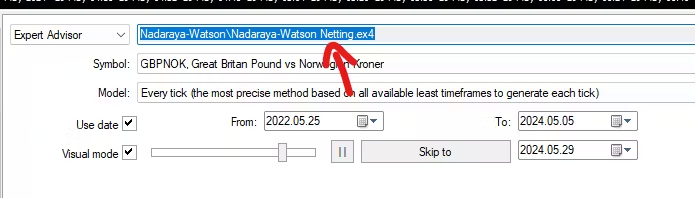
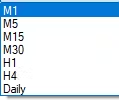
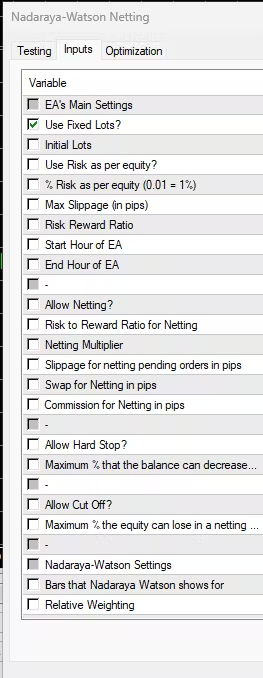

# Backtest Automater

Backtest Automater automates running back tests on MT4 and extracting data from generated back test reports. 
This is how it works:
- extracts data from existing HTML back test reports to an Excel file referred to as "Back Test Data".
- reads settings from another Excel file.
- configures the Strategy Tester in MT4 based on these settings.
- runs the Strategy Tester.
- downloads the generated reports into a folder.
- extracts data from these reports to "Back Test Data". 

The application uses `pywinauto` for automation.

## Pre-requisites
- Have a folder which will store all the generated back test reports. This will be referred to as "HTML Reports".
- Have an Excel file filled with settings which will be configured on the Strategy Tester. This will be referred to as "Settings". Intructions on filling it up are under the **"Instructions on filling the Settings file"** section.
- Have a blank Excel file which stores extracted data from back test reports. This will be referred to as "Back Test Data".
- MT4 should exist on the desktop

## What to do in the GUI
**HTML Reports folder**: This is supposed to be the path of the HTML Reports folder.
**Settings file**: This is supposed to be the path of the Settings file.
**Back Test Data file**: This is supposed to be the path the Back Test Data file.
**MT4 exe**: This is supposed to be the path of a terminal.exe file.
**MetaEditor exe**: This is supposed to be the path of a metaeditor.exe file.

Note: If the Stop button is clicked, the application will stop running after the current test is complete. So, it won't stop immediately.

## Instructions on filling the Settings file
1. The settings below should be filled up in the 1st worksheet of the Excel file.

2. There should be 7 column headers (The names of the columns which should be in the 1st row): Expert, Symbol, Period, From, To, Model and Expert properties.

3. To fill up the Expert column, find the EA you want in the Strategy Tester (like in the picture below) copy the path of the Expert Advisor and input that as a cell value under the column.

4. The possible values of the Period column are these only: 

5. The possible values of the Symbol column are the dropdown values of the Symbol input in the Strategy Tester. Just use the first 6 letters instead of writing the entire line.

6. The possible values of the Model column are these only: Every tick, Control points and Open prices.

7. The date format of the cells under the From and To columns should be yyyy-mm-dd.

8. The possible values of the “Use Date” and “Visual Mode” columns are “Yes” and “No”. If the value is “Yes”, that means that the checkbox associated with the column name will be checked. If the value is “No”, the checkbox will be unchecked. 

9. Under the “Expert properties” column, the format of each cell should be: [input name] = [input value]. Multiple of these must be separated by a comma. [input name] has to be an input which appears in the Inputs popup of the Expert Advisor:

10. Make sure that back testing data is available for the symbol, from and to dates that you've selected.

11. Make sure that the spelling and format of the cell values under all the columns are correct.

12. A cell value under a column can be left blank if it should not be configured on the Strategy Tester.
