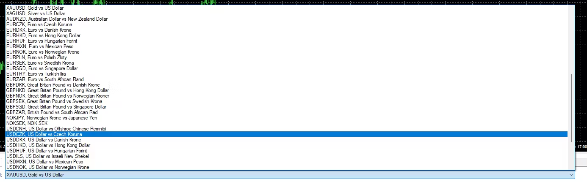

# Backtest Automater

Backtest Automater is designed to automate the use of the Strategy Tester in MT4. It:
- extracts data from existing HTML back test reports to an Excel file called Backtest Report Data.
- reads settings from an Excel file
- configures the Strategy Tester in MT4 based on these settings
- runs the Strategy Tester
- downloads the generated reports into a folder
- extracts data from these reports to Backtest Report Data. 

The application uses `pywinauto` for automation.

## Pre-requisites
- MT4 should exist on the desktop
- The EAs in the Instruction file should exist in MT4 in the "Experts" directory
- Make sure that back testing data is available for all the symbols, periods and date ranges in the Instruction file.

## GUI
**HTML Reports Folder Path**: This is supposed to be the path of the folder which will contain all the reports.
**Settings Excel Path**: This is supposed to be the path of the Excel file which has the settings for the Strategy Tester.
**Back Test Data Excel Path**: This is supposed to be the path of an Excel file. Extracted data from reports go here.
**MT4 EXE Path**: This is supposed to be the path of a terminal.exe file.
**MetaEditor EXE Path**: This is supposed to be the path of a metaeditor.exe file.

## Instructions on filling the Settings Excel file
For the Strategy Tester Settings file, there is a certain format that the values should be in.

1. There should be 7 column headers (The names of the columns which should be in the 1st row): Expert, Symbol, Period, From, To, Model, Expert properties
2. To fill up the Expert column, find the EA you want in the Strategy Tester (like in the picture below) copy the path of the Expert Advisor and input that as a cell value under the Expert column.

3. The possible values of the Period column are these only: 

4. The possible values of the Symbol column are the dropdown values of the Symbol input in the Strategy Tester:

5. The possible values of the Model column are these only: Every tick, Control points and Open prices
6. The date format of the cells under the From and To columns should be yyyy-mm-dd.
7. The possible values of the cells under the “Use Date” and “Visual Mode” headers are “Yes” and “No”. If the value is “Yes”, that means that the checkbox associated with the header will be checked. If the value is “No”, the checkbox associated with the header will be unchecked. 
8. Under the “Expert properties” column, the format of each cell should be: [input name] = [input value]. Multiple of these must be separated by commas. [input name] has to be an input which appears in the Inputs popup of the Expert Advisor:

9. Make sure that back testing data is available for the symbol, from & to dates in each row.
10. Make sure that the spelling and format of the cell values under all the columns are correct.
11. A cell value under a column can be left blank if it should not be configured on the Strategy Tester.